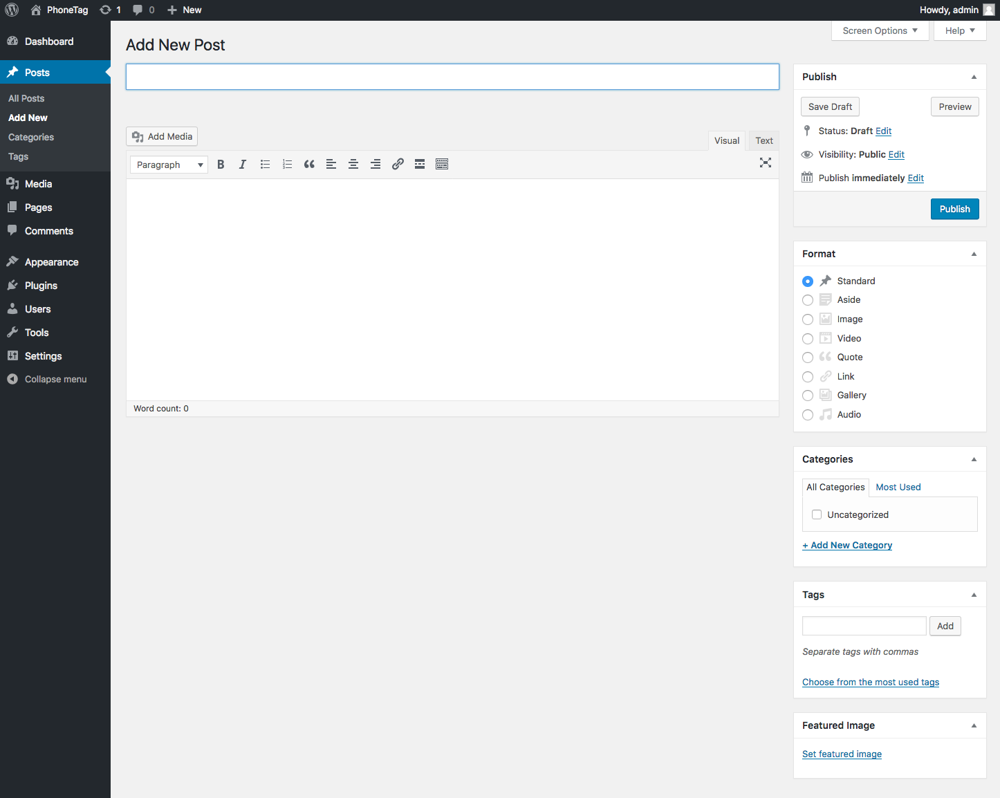

# Creating Posts

To create a new post:

1. Log into WordPress
2. There are a few ways you add a new post...
    - Hover your mouse over **Posts** and then click **Add New**
    - Click on **Posts**. Then under the new sub-nav that appears under Posts, click **Add New**.
    - Alternatively, after clicking on **Posts**, you can click on the **Add New** button that appears near the top of the page.

## Specific Topics

- [Filling in Fields](#fillingFields)
- [Choosing a Format](#choosingFormat)
- [Specifying Categories](#specifyingCategories)
- [Creating Tags](#creatingTags)
- [Setting a Featured Image](#featuredImage)
- [Password Protection](#passwordProtect)
- [Changing the Author](#changeAuthor)
- [Previewing Changes](#previewingChange)

###   Filling in the Fields

The only required field for posts is a **title**. Everything else can remain blank or default and still function.

###  Choosing a Format

Out of the box, WordPress offers eith different post formats in their pre-installed themes. These can be changed on a theme by theme basis so you may not always see the same types
across different sites. These types help you define what sort of content you are posting so that WordPress can handle them appropriately.

To change the type:

1. Look on the right side for the panel named **Format**
1. Choose the Format that best describes your content
1. Click **Update**, **Preview**, or **Save Draft** to view or save your changes

###  Specifying Categories

Before a post can be assigned to a category, the category has to be created first. Details of how create categories can be found here.

To assign a post to a specific categorie(s), simply select the category in the panel named **Categories**.

###  Creating Tags

Tags are a way to link content together based on commonalities such as topic, keywords, etc.

To add a tag:
1. Look on the right side for the panel named **Tags**
2. Begin typing a new tag name such as "astronomy" or "solar system"
3. To add more than one tag, separate them by a comma ","
4. Once you are finished, click the **Add** button
5. Click **Update**, **Preview**, or **Save Draft** to view or save your changes

###  Setting a Featured Image

Depending on the theme that is being used, a featured image may appear as a thumbnail, header image, or used in some other capacity.

To update the featured image:
1. Look on the right side for the **Featured Image** panel
2. Click on the **set featured image** link
3. You can either upload a new image or choose an existing one from the media gallery
4. Choose the image and then click the **Set Featured Image** button
5. Click **Update**, **Preview**, or **Save Draft** to view or save your changes

###  Password Protection

Password protecting a post enables you to require an arbitrary password in order to view the post.

To password protect a post:
1. Look in the **Publish** panel for the **Visibility** icon
2. Click the **edit** link next to this icon
3. In the dropdown, select the **Password protected** radio button
4. Type in a password
5. Click **Update**, **Preview**, or **Save Draft** to view or save your changes

###  Changing the Author

By default, WordPress does not show the **Author** panel. Before you can modify the author you will need to enable this panel.

1. When editing a post, look towards the top right of the screen. There are two tabs named **Screen Options** and **Help**
2. Click on the **Screen Options** tab
3. In the dropdown, tick the **Author** checkbox
4. Scroll down to the bottom of the screen and look for the **Author** panel that will appear somewhere on the left column
5. Choose an author from the dropdown
6. Click **Update**, **Preview**, or **Save Draft** to view or save your changes

###  Previewing Changes

It is helpful to view the changes to your post before making them live. 

To preview changes:
1. In the **Publish** panel click the **Preview Changes** button at the top
2. A new window will appear with your rendered post
